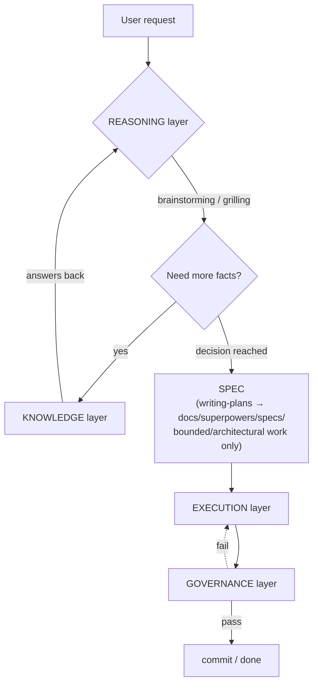

# Architecture — the whole stack by function, not by mechanism

Overview at [[index]] · technical detail on each item lives in [[mcp-servers]] and [[plugins]]

> [!info] Why this page exists
> [[plugins]] and [[mcp-servers]] group tools by **installation mechanism** (MCP server vs. plugin vs. skill), which is right for "how do I install this" but doesn't answer "what does this actually do in the bigger picture." Once the tool count reaches 15, that second question gets harder to answer. This page regroups everything by **actual function** instead, ignoring whether the mechanism underneath is an MCP server, a plugin, or a skill.

## Diagram

> [!note] How this differs from the diagram in [[USER-MANUAL]]
> The "micro cycle" diagram in [[USER-MANUAL]] shows the **event sequence within one turn**. This page shows **architectural role separation**. Different angles, meant to be read together, not as duplicates.

## KNOWLEDGE — surface facts from code, docs, or past memory

Job: answer "what's actually true" for REASONING and EXECUTION to consume — **not just "MCP servers,"** which is the usual mistake (graft-deep is a plugin, not an MCP server, and still belongs here by function).

| Tool | Mechanism | Job |
| --- | --- | --- |
| [[mcp-servers#graft — code-graph / context retrieval (per-project)\|graft]] | MCP | Search/understand existing code structure |
| [[plugins#graft-deep — custom plugin (auto-inject context)\|graft-deep]] | plugin | Auto-injects graft's search results into the prompt so the agent never has to call the tool itself |
| [[mcp-servers#context7 — search library/framework docs\|context7]] | MCP | Search external library/framework docs |
| [[mcp-servers#memory — persist context across sessions (official reference server)\|memory]] | MCP | Remembers facts across sessions |
| [[mcp-servers#open-design — pull files from an OpenDesign project\|open-design]] | MCP | Pulls files/assets designed in a separate tool |
| Direct file reads / grep | native tool | Fallback when there's no graft index or no MCP available (explicitly named as the fallback inside the `grilling` skill) |

## REASONING — settle "what to do" before acting

Job: clarify scope, ask questions, reach a decision with the user before EXECUTION has a SPEC to follow.

| Tool | Mechanism | Job |
| --- | --- | --- |
| [[plugins#superpowers — skill library\|brainstorming]] | skill (via the superpowers plugin) | The primary gate before any new creative work — classifies scope, asks one clarifying question at a time |
| [[plugins#grill-me / grilling — batch-interview skill (complements superpowers, not a plugin)\|grill-me / grilling]] | skill (Agent Skills standard) | Asks in batches, faster — good fit for a local model. **Doesn't replace** brainstorming, it lends its question format to it (see the reconciliation rule in the global `AGENTS.md`) |
| `writing-plans` | skill (superpowers) | Turns brainstorming's output into a SPEC file (`docs/superpowers/specs/`) — bounded/architectural work only |

## EXECUTION — actually do the work

Job: write/edit code, run tests, manage git — including **the gate that decides whether new code is even warranted** before starting.

> [!tip] Why ponytail lives here, not in REASONING
> ponytail's decision ladder (skip it if unnecessary → reuse → standard library → ...) fires **while about to write code**, not while settling scope with the user — a different question entirely (REASONING asks "what should we do," ponytail asks "is writing new code actually necessary"). That's why it's placed as this layer's first gate, not REASONING's.

| Tool | Mechanism | Job |
| --- | --- | --- |
| [[plugins#ponytail — code-minimization ruleset\|ponytail]] | plugin | Runs the decision ladder before any new code — this layer's first gate |
| `executing-plans`, `subagent-driven-development`, `dispatching-parallel-agents` | skill (superpowers) | Carries out the SPEC, possibly fanning work out to sub-agents |
| `using-git-worktrees`, `finishing-a-development-branch` | skill (superpowers) | Manages branches/worktrees during and after the work |
| [[mcp-servers#playwright — control a browser / e2e testing\|playwright]], [[mcp-servers#chrome-devtools — debug a live webpage\|chrome-devtools]] | MCP | Test/debug the real result in a browser |
| [[mcp-servers#postgres / mysql — query a database (disabled by default, enabled per project)\|postgres / mysql]] | MCP | Reads/writes real data during development |

## GOVERNANCE — verify before calling it "done"

Job: the last gate confirming quality/security before a commit — a failure here loops back to EXECUTION.

| Tool | Mechanism | Job |
| --- | --- | --- |
| `verification-before-completion` | skill (superpowers) | Confirms work is actually done as claimed before reporting to the user |
| `receiving-code-review`, `requesting-code-review` | skill (superpowers) | Code review, both directions |
| [[mcp-servers#sonarqube — code quality + security scan, self-hosted (via Docker)\|sonarqube]] | MCP | Code quality, security hotspots, coverage |
| [[mcp-servers#trivy — vulnerability/secret/misconfig scan (standalone CLI, no server needed)\|trivy]] | MCP | Vulnerability/secret/misconfig scanning |
| [[mcp-servers#github — manage issues/PR/code search through a structured tool (disabled until there's a token)\|github]] | MCP (disabled) | PR/issue workflow — not active yet, waiting on a token |

> [!warning] CI — doesn't exist yet (the same gap [[sdlc]] already flags)
> The proposed diagram this page is based on included "CI" inside the governance layer, but this setup has **no CI/CD pipeline at all** right now — sonarqube/trivy only run when the agent calls them during development; nothing runs automatically on merge/PR. Full gap detail and the proposed options (GitHub Actions + a trivy step) are in [[sdlc]], under CI/CD.

## Cross-cutting — not a layer, but composes with every layer

Following the same pattern [[sdlc]] already uses for Security/Documentation (not a separate phase — threaded through every phase instead) — these two shouldn't be forced into any one layer either:

- **[[plugins#i-have-adhd — forces terse, to-the-point replies\|i-have-adhd]]** — only changes response style, doesn't touch any layer's logic
- **The reconciliation rule in the global `AGENTS.md`** (see [[plugins]], grill-me/grilling) — a policy governing how two REASONING-layer skills cooperate, not a layer itself
- `using-superpowers`, `writing-skills` — meta-level skills (bootstrapping itself, authoring new skills) that don't run in the normal cycle

## Using this page when adding a new tool

Ask, in this order, before installing anything new:

1. Does it answer "what's actually true"? → KNOWLEDGE
2. Does it help settle "what to do" before acting? → REASONING
3. Is it the actual doing (writing code / testing / git)? → EXECUTION
4. Does it verify quality/security before calling something done? → GOVERNANCE
5. None of the above, but it composes with everything? → Cross-cutting (write down why explicitly, as done above — don't force it into a layer just to keep the table tidy)
