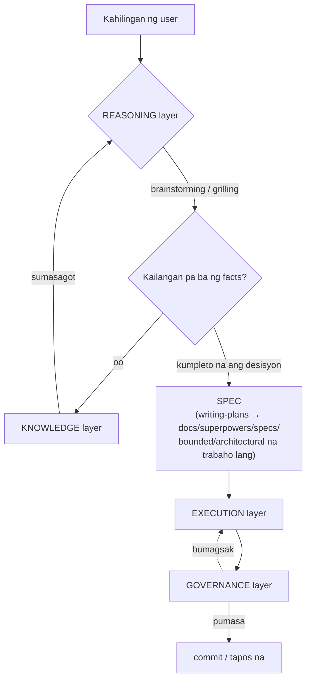

# Architecture — ang buong stack ayon sa trabaho, hindi ayon sa mekanismo

Buod nasa [[index]] · ang detalyadong teknikal na impormasyon ng bawat isa nasa [[mcp-servers]] at [[plugins]]

> [!info] Bakit kailangan ng page na ito
> Ang [[plugins]] at [[mcp-servers]] ay pinagpu-grupo ang mga tool ayon sa **paraan ng pag-install** (MCP server kumpara sa plugin kumpara sa skill), na tama kung ang tanong ay "paano ito i-install" pero hindi sinasagot ang "ano ba talaga ang trabaho nito sa malaking larawan." Kapag umabot na sa 15 ang bilang ng tool, mas mahirap sagutin ang ikalawang tanong. Ang page na ito ay muling nag-gru-grupo ayon sa **aktwal na trabaho** sa halip, hindi mahalaga kung MCP server, plugin, o skill ang nasa likod nito.

## Diagram

> [!note] Kaiba ito sa diagram sa [[USER-MANUAL]]
> Ang "micro cycle" diagram sa [[USER-MANUAL]] ay nagpapakita ng **pagkakasunod-sunod ng event sa loob ng isang turn**. Ang page na ito ay nagpapakita ng **paghahati ng papel sa antas ng architecture**. Magkaibang anggulo, dapat basahin nang magkasama, hindi duplicate.

## KNOWLEDGE — humanap ng katotohanan mula sa code, docs, o dating memory

Trabaho: sagutin ang "ano ba talaga ang totoo" para sa REASONING at EXECUTION — **hindi lang "MCP servers,"** na siyang karaniwang pagkakamali (ang graft-deep ay plugin, hindi MCP server, pero nandito pa rin ayon sa trabaho).

| Tool | Mekanismo | Trabaho |
| --- | --- | --- |
| [[mcp-servers#graft — code-graph / context retrieval (per-project)\|graft]] | MCP | Maghanap/unawain ang kasalukuyang istruktura ng code |
| [[plugins#graft-deep — custom plugin (auto-inject context)\|graft-deep]] | plugin | Awtomatikong isinisingit ang resulta ng graft sa prompt para hindi na kailangang tawagin ng agent mismo |
| [[mcp-servers#context7 — maghanap ng docs ng library/framework\|context7]] | MCP | Maghanap ng docs ng panlabas na library/framework |
| [[mcp-servers#memory — panatilihin ang context sa buong sessions (opisyal na reference server)\|memory]] | MCP | Natatandaan ang mga fact kahit magpalit ng session |
| [[mcp-servers#open-design — kumuha ng files mula sa isang OpenDesign project\|open-design]] | MCP | Kumukuha ng files/asset na na-design sa ibang tool |
| Direktang pagbasa ng file / grep | native tool | Fallback kapag walang graft index o walang MCP na magagamit (malinaw na nakasaad bilang fallback sa loob ng `grilling` skill) |

## REASONING — pagpasyahan ang "ano ang gagawin" bago kumilos

Trabaho: linawin ang scope, magtanong, magkaroon ng desisyon kasama ang user bago magkaroon ng SPEC ang EXECUTION na susundan.

| Tool | Mekanismo | Trabaho |
| --- | --- | --- |
| [[plugins#superpowers — skill library\|brainstorming]] | skill (sa pamamagitan ng superpowers plugin) | Ang pangunahing gate bago ang anumang bagong malikhaing trabaho — ini-classify ang scope, nagtatanong nang isa-isa |
| [[plugins#grill-me / grilling — batch-interview skill (dagdag sa superpowers, hindi plugin)\|grill-me / grilling]] | skill (Agent Skills standard) | Nagtatanong nang batch, mas mabilis — maganda para sa local model. **Hindi pinapalitan** ang brainstorming, hinihiram lang nito ang format ng tanong (tingnan ang reconciliation rule sa global `AGENTS.md`) |
| `writing-plans` | skill (superpowers) | Ginagawang SPEC file ang resulta ng brainstorming (`docs/superpowers/specs/`) — bounded/architectural na trabaho lang |

## EXECUTION — aktwal na gawin ang trabaho

Trabaho: sumulat/mag-edit ng code, magpatakbo ng test, mamahala ng git — kasama ang **gate na nagpapasya kung talagang kinakailangan ang bagong code** bago simulan.

> [!tip] Bakit nasa layer na ito ang ponytail, hindi sa REASONING
> Ang decision ladder ng ponytail (laktawan kung hindi kailangan → gamitin ulit → standard library → ...) ay gumagana **habang malapit nang sumulat ng code**, hindi habang nililinaw ang scope kasama ang user — ibang tanong ito (ang REASONING ay nagtatanong ng "ano ang dapat gawin," ang ponytail ay nagtatanong ng "kailangan ba talaga ng bagong code"). Kaya nakalagay ito bilang unang gate ng layer na ito, hindi ng REASONING.

| Tool | Mekanismo | Trabaho |
| --- | --- | --- |
| [[plugins#ponytail — code-minimization ruleset\|ponytail]] | plugin | Tinatakbo ang decision ladder bago ang anumang bagong code — unang gate ng layer na ito |
| `executing-plans`, `subagent-driven-development`, `dispatching-parallel-agents` | skill (superpowers) | Isinasagawa ang SPEC, posibleng ipamahagi ang trabaho sa mga sub-agent |
| `using-git-worktrees`, `finishing-a-development-branch` | skill (superpowers) | Namamahala ng branch/worktree habang at pagkatapos ng trabaho |
| [[mcp-servers#playwright — kontrolin ang browser / e2e testing\|playwright]], [[mcp-servers#chrome-devtools — i-debug ang live na webpage\|chrome-devtools]] | MCP | Testing/debug ng aktwal na resulta sa browser |
| [[mcp-servers#postgres / mysql — mag-query ng database (naka-disable by default, ine-enable per project)\|postgres / mysql]] | MCP | Pagbasa/pagsulat ng tunay na data habang nagde-develop |

## GOVERNANCE — beripikahin bago ituring na "tapos na"

Trabaho: ang huling gate na nagkukumpirma ng kalidad/seguridad bago mag-commit — kung bumagsak dito, babalik sa EXECUTION.

| Tool | Mekanismo | Trabaho |
| --- | --- | --- |
| `verification-before-completion` | skill (superpowers) | Kinukumpirma na tapos na talaga ang trabaho bago iulat sa user |
| `receiving-code-review`, `requesting-code-review` | skill (superpowers) | Code review, sa parehong direksyon |
| [[mcp-servers#sonarqube — code quality + security scan, self-hosted (via Docker)\|sonarqube]] | MCP | Code quality, security hotspot, coverage |
| [[mcp-servers#trivy — vulnerability/secret/misconfig scan (standalone CLI, walang kailangang server)\|trivy]] | MCP | Pag-scan ng vulnerability/secret/misconfig |
| [[mcp-servers#github — pamahalaan ang issues/PR/code search sa pamamagitan ng structured tool (naka-disable hanggang may token)\|github]] | MCP (naka-disable) | Workflow ng PR/issue — hindi pa aktibo, naghihintay ng token |

> [!warning] CI — wala pa ito (parehong gap na nakasaad na sa [[sdlc]])
> Kasama ang "CI" sa iminungkahing diagram na batay dito sa governance layer, pero **walang anumang CI/CD pipeline** ang setup na ito sa ngayon — ang sonarqube/trivy ay tumatakbo lang kapag tinawag ng agent habang nagde-develop; walang tumatakbo nang awtomatiko sa merge/PR. Ang kumpletong detalye ng gap at ang mga iminungkahing opsyon (GitHub Actions + trivy step) ay nasa [[sdlc]], sa ilalim ng CI/CD.

## Cross-cutting — hindi layer, pero sumasama sa bawat layer

Sinusunod ang parehong pattern na ginagamit na ng [[sdlc]] para sa Security/Documentation (hindi hiwalay na phase — ikinakabit sa bawat phase) — hindi dapat ipilit ang dalawang ito sa alinmang layer:

- **[[plugins#i-have-adhd — pinipilit ang maikli, diretso-sa-punto na sagot\|i-have-adhd]]** — pinapalitan lang ang istilo ng sagot, hindi hinihipo ang logic ng anumang layer
- **Ang reconciliation rule sa global `AGENTS.md`** (tingnan ang [[plugins]], grill-me/grilling) — isang policy na namamahala kung paano magtulungan ang dalawang skill sa REASONING layer, hindi isang layer mismo
- `using-superpowers`, `writing-skills` — mga skill sa antas ng meta (nagsisimula sa sarili nito, gumagawa ng bagong skill) na hindi tumatakbo sa normal na cycle

## Paggamit ng page na ito kapag magdaragdag ng bagong tool

Itanong sa pagkakasunod-sunod na ito bago mag-install ng anumang bago:

1. Sinasagot ba nito ang "ano ba talaga ang totoo"? → KNOWLEDGE
2. Tumutulong ba itong linawin ang "ano ang dapat gawin" bago kumilos? → REASONING
3. Ito ba ang aktwal na paggawa (pagsulat ng code / testing / git)? → EXECUTION
4. Bine-beripika ba nito ang kalidad/seguridad bago ituring na tapos? → GOVERNANCE
5. Wala sa mga ito, pero sumasama sa lahat? → Cross-cutting (isulat nang malinaw kung bakit, katulad sa itaas — huwag ipilit sa isang layer para lang maging maayos ang table)
