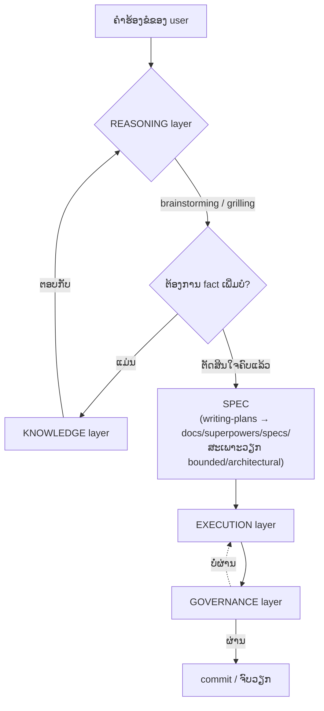

# Architecture — ເບິ່ງ stack ທັງໝົດຕາມໜ້າທີ່ ບໍ່ແມ່ນຕາມກົນໄກ

ພາບລວມຢູ່ [[index]] · ລາຍລະອຽດທາງເທັກນິກຂອງແຕ່ລະໂຕຢູ່ [[mcp-servers]] ແລະ [[plugins]]

> [!info] ເປັນຫຍັງຕ້ອງມີໜ້ານີ້
> [[plugins]] ແລະ [[mcp-servers]] ຈັດກຸ່ມເຄື່ອງມືຕາມ**ກົນໄກການຕິດຕັ້ງ** (MCP server ຫຼື plugin ຫຼື skill) ເຊິ່ງເໝາະກັບຄຳຖາມ "ຈະຕິດຕັ້ງແນວໃດ" ແຕ່ບໍ່ຕອບຄຳຖາມ "ໂຕນີ້ເຮັດໜ້າທີ່ຫຍັງໃນພາບລວມ" — ພໍເຄື່ອງມືເພີ່ມຮອດ 15 ໂຕ ຄຳຖາມທີ່ສອງເລີ່ມຕອບຍາກຂຶ້ນເລື້ອຍໆ ໜ້ານີ້ຈັດກຸ່ມໃໝ່ຕາມ**ໜ້າທີ່ຈິງ** ແທນ ໂດຍບໍ່ສົນວ່າເບື້ອງຫຼັງແມ່ນ MCP, plugin ຫຼື skill

## Diagram

> [!note] ຕ່າງຈາກ diagram ໃນ [[USER-MANUAL]] ແນວໃດ
> diagram "micro cycle" ໃນ [[USER-MANUAL]] ສະແດງ**ລຳດັບເຫດການຕໍ່ 1 turn** — ໜ້ານີ້ສະແດງ**ການແບ່ງໜ້າທີ່ລະດັບສະຖາປັດຕະຍະກຳ** ຄົນລະມູມກັນ ໃຊ້ຄູ່ກັນໄດ້ ບໍ່ຊ້ອນກັນ

## KNOWLEDGE — ຄົ້ນຫາຂໍ້ເທັດຈິງຈາກໂຄ້ດ/ເອກະສານ/ຄວາມຈຳເກົ່າ

ໜ້າທີ່: ຕອບຄຳຖາມ "ຂໍ້ເທັດຈິງແມ່ນຫຍັງ" ໃຫ້ REASONING ແລະ EXECUTION ເອີ້ນໃຊ້ — **ບໍ່ແມ່ນແຄ່ MCP** ຄືທີ່ມັກເຂົ້າໃຈກັນ (graft-deep ເປັນ plugin ບໍ່ແມ່ນ MCP ແຕ່ເຮັດໜ້າທີ່ knowledge ເຕັມໆ)

| ເຄື່ອງມື | ກົນໄກ | ເຮັດໜ້າທີ່ຫຍັງ |
| --- | --- | --- |
| [[mcp-servers#graft — code-graph / context retrieval (per-project)\|graft]] | MCP | ຄົ້ນຫາ/ເຂົ້າໃຈໂຄງສ້າງໂຄ້ດທີ່ມີຢູ່ |
| [[plugins#graft-deep — custom plugin (auto-inject context)\|graft-deep]] | plugin | auto-inject ຜົນຄົ້ນຫາຈາກ graft ເຂົ້າ prompt ເອງ ບໍ່ຕ້ອງໃຫ້ agent ເອີ້ນ tool ເອງ |
| [[mcp-servers#context7 — ຄົ້ນຫາ docs library/framework\|context7]] | MCP | ຄົ້ນຫາ docs ຂອງ library/framework ພາຍນອກ |
| [[mcp-servers#memory — ຈື່ context ຂ້າມ session (official reference server)\|memory]] | MCP | ຈື່ fact ຂ້າມ session |
| [[mcp-servers#open-design — ດຶງໄຟລ໌ຈາກ project OpenDesign\|open-design]] | MCP | ດຶງໄຟລ໌/asset ທີ່ອອກແບບໄວ້ໃນເຄື່ອງມືແຍກ |
| ອ່ານໄຟລ໌ໂດຍກົງ / grep | native tool | fallback ເມື່ອບໍ່ມີ graft index ຫຼືບໍ່ມີ MCP ໃຫ້ໃຊ້ (ລະບຸໄວ້ຊັດເຈນໃນ `grilling` skill) |

## REASONING — ຕົກຜົນລົງວ່າ "ຈະເຮັດຫຍັງ" ກ່ອນລົງມື

ໜ້າທີ່: ຊີ້ແຈງ scope, ຖາມຄຳຖາມ, ຕັດສິນໃຈຮ່ວມກັບຜູ້ໃຊ້ ກ່ອນທີ່ EXECUTION ຈະມີ SPEC ໃຫ້ເຮັດຕາມ

| ເຄື່ອງມື | ກົນໄກ | ເຮັດໜ້າທີ່ຫຍັງ |
| --- | --- | --- |
| [[plugins#superpowers — skill library\|brainstorming]] | skill (ຜ່ານ superpowers plugin) | ເກດຫຼັກກ່ອນວຽກສ້າງໃໝ່ທຸກຄັ້ງ — classify scope, ຖາມເທື່ອລະຂໍ້ |
| [[plugins#grill-me / grilling — batch-interview skill (ເສີມ superpowers, ບໍ່ແມ່ນ plugin)\|grill-me / grilling]] | skill (Agent Skills standard) | ຖາມແບບ batch ໄວກວ່າ ເໝາະ local model — **ບໍ່ແທນທີ່** brainstorming ແຕ່ເສີມ format ຄຳຖາມ (ເບິ່ງກົດ reconcile ໃນ global `AGENTS.md`) |
| `writing-plans` | skill (superpowers) | ປ່ຽນຜົນຈາກ brainstorming ເປັນ SPEC file (`docs/superpowers/specs/`) — ສະເພາະວຽກ bounded/architectural |

## EXECUTION — ລົງມືເຮັດຈິງ

ໜ້າທີ່: ຂຽນ/ແກ້ໂຄ້ດ, ລັນ test, ຈັດການ git — ລວມທັງ**ດ່ານຕັດສິນໃຈວ່າຈະຂຽນໂຄ້ດໃໝ່ຈິງບໍ**ກ່ອນເລີ່ມ

> [!tip] ເປັນຫຍັງ ponytail ຢູ່ບ່ອນນີ້ ບໍ່ແມ່ນ REASONING
> decision ladder ຂອງ ponytail (ບໍ່ຈຳເປັນກໍ່ບໍ່ຂຽນ → reuse → standard library → ...) ເຮັດວຽກ**ຕອນກຳລັງຈະຂຽນໂຄ້ດຈິງ** ບໍ່ແມ່ນຕອນຕົກຜົນລົງ scope ກັບຜູ້ໃຊ້ — ເປັນຄົນລະຄຳຖາມກັນ (REASONING ຖາມວ່າ "ຈະເຮັດຫຍັງ", ponytail ຖາມວ່າ "ຂຽນໂຄ້ດໃໝ່ຈຳເປັນຈິງບໍ") ຈຶ່ງຈັດໄວ້ເປັນດ່ານທຳອິດຂອງ EXECUTION ບໍ່ແມ່ນ REASONING

| ເຄື່ອງມື | ກົນໄກ | ເຮັດໜ້າທີ່ຫຍັງ |
| --- | --- | --- |
| [[plugins#ponytail — code-minimization ruleset\|ponytail]] | plugin | ກວດ decision ladder ກ່ອນຂຽນໂຄ້ດໃໝ່ — ດ່ານທຳອິດຂອງ layer ນີ້ |
| `executing-plans`, `subagent-driven-development`, `dispatching-parallel-agents` | skill (superpowers) | ເຮັດຕາມ SPEC ຈິງ ອາດກະຈາຍວຽກເປັນ subagent |
| `using-git-worktrees`, `finishing-a-development-branch` | skill (superpowers) | ຈັດການ branch/worktree ລະຫວ່າງແລະຫຼັງເຮັດວຽກ |
| [[mcp-servers#playwright — ຄວບຄຸມ browser / e2e testing\|playwright]], [[mcp-servers#chrome-devtools — debug ໜ້າເວັບສົດ\|chrome-devtools]] | MCP | ທົດສອບ/debug ຜົນລັບຈິງໃນ browser |
| [[mcp-servers#postgres / mysql — query database (ປິດໄວ້ກ່ອນ, ເປີດຕໍ່ project)\|postgres / mysql]] | MCP | ເຂົ້າເຖິງ/ແກ້ຂໍ້ມູນຈິງລະຫວ່າງພັດທະນາ |

## GOVERNANCE — ກວດສອບກ່ອນຖືວ່າ "ສຳເລັດ"

ໜ້າທີ່: ເປັນດ່ານສຸດທ້າຍຢືນຢັນຄຸນນະພາບ/ຄວາມປອດໄພ ກ່ອນ commit — ຖ້າບໍ່ຜ່ານ ວົນກັບໄປ EXECUTION

| ເຄື່ອງມື | ກົນໄກ | ເຮັດໜ້າທີ່ຫຍັງ |
| --- | --- | --- |
| `verification-before-completion` | skill (superpowers) | ກວດວ່າວຽກສຳເລັດຈິງຕາມທີ່ອ້າງກ່ອນລາຍງານຜູ້ໃຊ້ |
| `receiving-code-review`, `requesting-code-review` | skill (superpowers) | ຂັ້ນຕອນ code review ທັງສອງທິດທາງ |
| [[mcp-servers#sonarqube — code quality + security scan ແບບ self-hosted (ຜ່ານ Docker)\|sonarqube]] | MCP | code quality, security hotspot, coverage |
| [[mcp-servers#trivy — vulnerability/secret/misconfig scan (standalone CLI, ບໍ່ຕ້ອງມີ server)\|trivy]] | MCP | ກວດ vulnerability/secret/misconfig |
| [[mcp-servers#github — ຈັດການ issues/PR/code search ຜ່ານ structured tool (ປິດໄວ້ກ່ອນ ຈົນກວ່າຈະມີ token)\|github]] | MCP (ປິດໄວ້) | workflow ຂອງ PR/issue — ຍັງບໍ່ active ຈົນກວ່າຈະມີ token |

> [!warning] CI — ຍັງບໍ່ມີເລີຍ (ຊ່ອງຫວ່າງດຽວກັບທີ່ [[sdlc]] ລະບຸໄວ້)
> diagram ທີ່ສະເໜີມາ ມີ "CI" ຢູ່ໃນ governance layer ແຕ່ setup ນີ້**ບໍ່ມີ CI/CD pipeline ໃດໆເລີຍ** ຕອນນີ້ — sonarqube/trivy ເຮັດວຽກແບບ agent ເອີ້ນເອງລະຫວ່າງ dev ເທົ່ານັ້ນ ບໍ່ມີຫຍັງລັນອັດຕະໂນມັດຕອນ merge/PR ລາຍລະອຽດຊ່ອງຫວ່າງເຕັມໆ ແລະທາງເລືອກທີ່ສະເໜີໄວ້ (GitHub Actions + trivy step) ເບິ່ງທີ່ [[sdlc]] ຫົວຂໍ້ CI/CD

## Cross-cutting — ບໍ່ແມ່ນ layer ແຕ່ compose ກັບທຸກ layer

ຕາມ pattern ດຽວກັບທີ່ [[sdlc]] ຈັດການ Security/Documentation (ບໍ່ແມ່ນ phase ແຍກ ແຕ່ແຊກທຸກບ່ອນ) — ສອງຢ່າງນີ້ກໍ່ບໍ່ຄວນຖືກຍັດເຂົ້າ layer ໃດໂດຍສະເພາະ:

- **[[plugins#i-have-adhd — ບັງຄັບຕອບກົງປະເດັນ ບໍ່ອ້ອມແອ້ມ\|i-have-adhd]]** — ປ່ຽນແຄ່ style ການຕອບ ບໍ່ແຕະ layer ໃດເລີຍ
- **ກົດ reconcile ໃນ global `AGENTS.md`** (ເບິ່ງ [[plugins]] ຫົວຂໍ້ grill-me/grilling) — ເປັນ policy ທີ່ຄວບຄຸມວ່າ REASONING layer ສອງ skill ເຮັດວຽກຮ່ວມກັນແນວໃດ ບໍ່ແມ່ນຕົວ layer ເອງ
- `using-superpowers`, `writing-skills` — skill ລະດັບ meta (bootstrap ຕົນເອງ, ສ້າງ skill ໃໝ່) ບໍ່ໄດ້ເຮັດວຽກໃນວົງຈອນປົກກະຕິ

## ວິທີໃຊ້ໜ້ານີ້ຕອນຈະເພີ່ມເຄື່ອງມືໃໝ່

ຖາມຕາມລຳດັບນີ້ກ່ອນຕິດຕັ້ງຫຍັງໃໝ່:

1. ມັນຕອບຄຳຖາມ "ຂໍ້ເທັດຈິງແມ່ນຫຍັງ" ບໍ → KNOWLEDGE
2. ມັນຊ່ວຍຕົກຜົນລົງວ່າ "ຈະເຮັດຫຍັງ" ກ່ອນລົງມືບໍ → REASONING
3. ມັນຄືການລົງມືເຮັດຈິງ (ຂຽນໂຄ້ດ/test/git) ບໍ → EXECUTION
4. ມັນກວດສອບຄຸນນະພາບ/ຄວາມປອດໄພກ່ອນຖືວ່າສຳເລັດບໍ → GOVERNANCE
5. ບໍ່ເຂົ້າຂໍ້ໃດເລີຍ ແຕ່ compose ກັບທຸກຢ່າງ → Cross-cutting (ຂຽນເຫດຜົນໄວ້ໃຫ້ຊັດ ຄືຫົວຂໍ້ເທິງນີ້ ຢ່າຝືນຍັດເຂົ້າ layer ໃດເພື່ອຄວາມສວຍງາມ)
