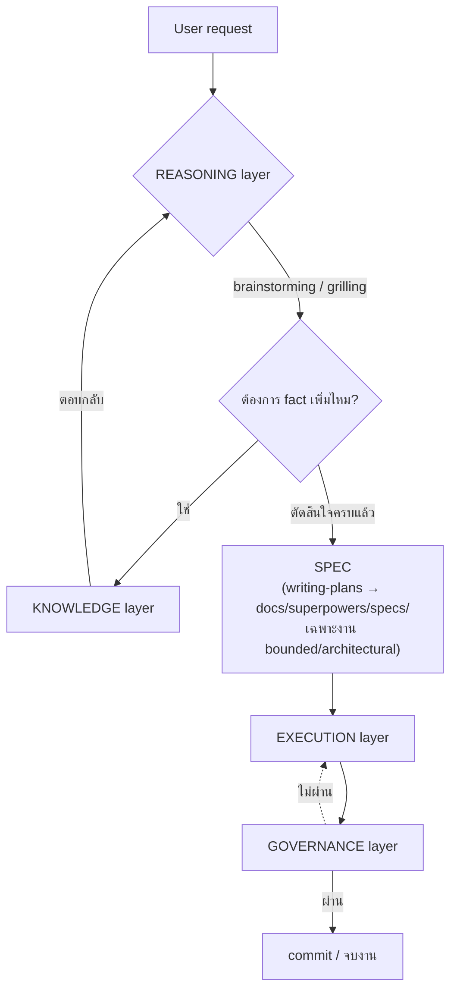

# Architecture — มองทั้ง stack ตามหน้าที่ ไม่ใช่ตามกลไก

ภาพรวมที่ [[index]] · รายละเอียดเชิงเทคนิคของแต่ละตัวอยู่ที่ [[mcp-servers]] และ [[plugins]]

> [!info] ทำไมต้องมีหน้านี้
> [[plugins]] และ [[mcp-servers]] จัดกลุ่มเครื่องมือตาม**กลไกที่ติดตั้ง** (MCP server vs plugin vs skill) ซึ่งเหมาะกับตอน "จะติดตั้งยังไง" แต่ไม่ตอบคำถาม "ตัวนี้ทำหน้าที่อะไรในภาพรวม" — พอเครื่องมือเพิ่มถึง 15 ตัว คำถามหลังเริ่มตอบยากขึ้นเรื่อยๆ หน้านี้จัดกลุ่มใหม่ตาม**หน้าที่จริง** (function) แทน โดยไม่สนใจว่าเบื้องหลังคือ MCP, plugin หรือ skill

## Diagram

> [!note] ต่างจาก diagram เดิมใน [[USER-MANUAL]] ตรงไหน
> diagram "micro cycle" ใน [[USER-MANUAL]] แสดง**ลำดับเหตุการณ์ต่อ 1 turn** (event sequence) — หน้านี้แสดง**การแบ่งหน้าที่ระดับสถาปัตยกรรม** (architecture) คนละมุมกัน ใช้คู่กันได้ ไม่ทับซ้อน

## KNOWLEDGE — หาข้อเท็จจริงจากโค้ด/เอกสาร/ความจำเก่า

หน้าที่: ตอบคำถาม "ข้อเท็จจริงคืออะไร" ให้ REASONING และ EXECUTION เรียกใช้ — **ไม่ใช่แค่ MCP** อย่างที่มักเข้าใจกัน (graft-deep เป็น plugin ไม่ใช่ MCP แต่ทำหน้าที่ knowledge เต็มๆ)

| เครื่องมือ | กลไก | ทำหน้าที่อะไร |
| --- | --- | --- |
| [[mcp-servers#graft — code-graph / context retrieval (per-project)\|graft]] | MCP | ค้นหา/เข้าใจโครงสร้างโค้ดที่มีอยู่ |
| [[plugins#graft-deep — custom plugin (auto-inject context)\|graft-deep]] | plugin | auto-inject ผลค้นหาจาก graft เข้า prompt เอง ไม่ต้องให้ agent เรียก tool เอง |
| [[mcp-servers#context7 — ค้นหา docs library/framework\|context7]] | MCP | ค้นหา docs ของ library/framework ภายนอก |
| [[mcp-servers#memory — จำ context ข้ามเซสชัน (official reference server)\|memory]] | MCP | จำ fact ข้าม session |
| [[mcp-servers#open-design — ดึงไฟล์จากโปรเจกต์ OpenDesign\|open-design]] | MCP | ดึงไฟล์/asset ที่ออกแบบไว้ในเครื่องมือแยก |
| อ่านไฟล์ตรงๆ / grep | native tool | fallback เมื่อไม่มี graft index หรือไม่มี MCP ให้ใช้ (ระบุไว้ชัดใน `grilling` skill) |

## REASONING — ตกผลึกว่า "จะทำอะไร" ก่อนลงมือ

หน้าที่: ชี้แจง scope, ถามคำถาม, ตัดสินใจร่วมกับผู้ใช้ ก่อนมี SPEC ให้ EXECUTION ทำตาม

| เครื่องมือ | กลไก | ทำหน้าที่อะไร |
| --- | --- | --- |
| [[plugins#superpowers — skill library\|brainstorming]] | skill (ผ่าน superpowers plugin) | เกตหลักก่อนงานสร้างใหม่ทุกครั้ง — classify scope, ถามทีละข้อ |
| [[plugins#grill-me / grilling — batch-interview skill (เสริม superpowers, ไม่ใช่ plugin)\|grill-me / grilling]] | skill (Agent Skills standard) | ถามแบบ batch เร็วกว่า เหมาะ local model — **ไม่แทนที่** brainstorming แต่เสริม format คำถาม (ดูกฎ reconcile ใน global `AGENTS.md`) |
| `writing-plans` | skill (superpowers) | แปลงผลจาก brainstorming เป็น SPEC file (`docs/superpowers/specs/`) — เฉพาะงาน bounded/architectural |

## EXECUTION — ลงมือทำจริง

หน้าที่: เขียน/แก้โค้ด, รัน test, จัดการ git — รวมถึง**ด่านตัดสินใจว่าจะเขียนโค้ดใหม่จริงไหม**ก่อนเริ่ม

> [!tip] ทำไม ponytail อยู่ตรงนี้ ไม่ใช่ REASONING
> ponytail's decision ladder (ไม่จำเป็นก็ไม่เขียน → reuse → standard library → ...) ทำงาน**ตอนกำลังจะเขียนโค้ดจริง** ไม่ใช่ตอนตกผลึก scope กับผู้ใช้ — เป็นคนละคำถามกัน (REASONING ถามว่า "จะทำอะไร", ponytail ถามว่า "เขียนโค้ดใหม่จำเป็นจริงไหม") เลยจัดไว้เป็นด่านแรกของ EXECUTION ไม่ใช่ REASONING

| เครื่องมือ | กลไก | ทำหน้าที่อะไร |
| --- | --- | --- |
| [[plugins#ponytail — code minimization ruleset\|ponytail]] | plugin | เช็ค decision ladder ก่อนเขียนโค้ดใหม่ — ด่านแรกของ layer นี้ |
| `executing-plans`, `subagent-driven-development`, `dispatching-parallel-agents` | skill (superpowers) | ทำตาม SPEC จริง อาจกระจายงานเป็น subagent |
| `using-git-worktrees`, `finishing-a-development-branch` | skill (superpowers) | จัดการ branch/worktree ระหว่างและหลังทำงาน |
| [[mcp-servers#playwright — ควบคุมเบราว์เซอร์ / e2e testing\|playwright]], [[mcp-servers#chrome-devtools — debug หน้าเว็บสด\|chrome-devtools]] | MCP | ทดสอบ/debug ผลลัพธ์จริงในเบราว์เซอร์ |
| [[mcp-servers#postgres / mysql — query database (ปิดไว้ก่อน, เปิดต่อโปรเจกต์)\|postgres / mysql]] | MCP | เข้าถึง/แก้ข้อมูลจริงระหว่างพัฒนา |

## GOVERNANCE — ตรวจสอบก่อนถือว่า "เสร็จ"

หน้าที่: เป็นด่านสุดท้ายยืนยันคุณภาพ/ความปลอดภัย ก่อน commit — ถ้าไม่ผ่าน วนกลับไป EXECUTION

| เครื่องมือ | กลไก | ทำหน้าที่อะไร |
| --- | --- | --- |
| `verification-before-completion` | skill (superpowers) | เช็คว่างานเสร็จจริงตามที่อ้างก่อนรายงานผู้ใช้ |
| `receiving-code-review`, `requesting-code-review` | skill (superpowers) | ขั้นตอน code review ทั้งสองทิศทาง |
| [[mcp-servers#sonarqube — code quality + security scan แบบ self-hosted (ผ่าน Docker)\|sonarqube]] | MCP | code quality, security hotspot, coverage |
| [[mcp-servers#trivy — vulnerability/secret/misconfig scan (standalone CLI, ไม่ต้องมี server)\|trivy]] | MCP | vulnerability/secret/misconfig scan |
| [[mcp-servers#github — จัดการ issues/PR/code search ผ่าน structured tool (ปิดไว้ก่อน จนกว่าจะมี token)\|github]] | MCP (ปิดไว้) | PR/issue workflow — ยังไม่ active จนกว่าจะมี token |

> [!warning] CI — ยังไม่มีเลย (gap ตรงกับที่ [[sdlc]] ระบุไว้)
> diagram ที่เสนอมามี "CI" อยู่ใน governance layer แต่ setup นี้**ไม่มี CI/CD pipeline ใดๆ ทั้งสิ้น** ตอนนี้ — sonarqube/trivy ทำงานแบบ agent เรียกเองระหว่าง dev เท่านั้น ไม่มีอะไรรันอัตโนมัติตอน merge/PR รายละเอียด gap เต็มๆ และตัวเลือกที่เสนอไว้ (GitHub Actions + trivy step) ดูที่ [[sdlc]] หัวข้อ CI/CD

## Cross-cutting — ไม่ใช่ layer แต่ compose กับทุก layer

ตาม pattern เดียวกับที่ [[sdlc]] จัดการ Security/Documentation (ไม่ใช่ phase แยก แต่แทรกทุกที่) — สองอย่างนี้ก็ไม่ควรถูกยัดเข้า layer ใดโดยเฉพาะ:

- **[[plugins#i-have-adhd — บังคับตอบตรงประเด็น ไม่อ้อมค้อม\|i-have-adhd]]** — เปลี่ยนแค่สไตล์การตอบ ไม่แตะ layer ไหนเลย
- **กฎ reconcile ใน global `AGENTS.md`** (ดู [[plugins]] หัวข้อ grill-me/grilling) — เป็น policy ที่ควบคุมว่า REASONING layer สอง skill ทำงานร่วมกันยังไง ไม่ใช่ตัว layer เอง
- `using-superpowers`, `writing-skills` — skill ระดับ meta (bootstrap ตัวเอง, สร้าง skill ใหม่) ไม่ได้ทำงานในวงจรปกติ

## วิธีใช้หน้านี้เวลาจะเพิ่มเครื่องมือใหม่

ถามตามลำดับนี้ก่อนติดตั้งอะไรใหม่:

1. มันตอบคำถาม "ข้อเท็จจริงคืออะไร" ไหม → KNOWLEDGE
2. มันช่วยตกผลึกว่า "จะทำอะไร" ก่อนลงมือไหม → REASONING
3. มันคือการลงมือทำจริง (เขียนโค้ด/test/git) ไหม → EXECUTION
4. มันตรวจสอบคุณภาพ/ความปลอดภัยก่อนถือว่าเสร็จไหม → GOVERNANCE
5. ไม่เข้าข้อไหนเลย แต่ compose กับทุกอย่าง → Cross-cutting (เขียนเหตุผลไว้ตรงๆ เหมือนหัวข้อบน อย่าฝืนยัดเข้า layer ใดเพื่อความสวยงาม)
