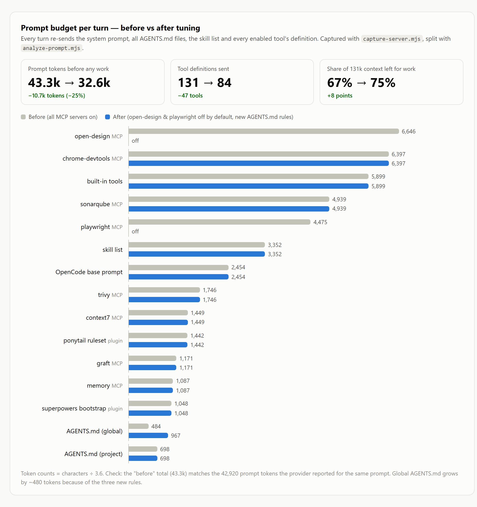
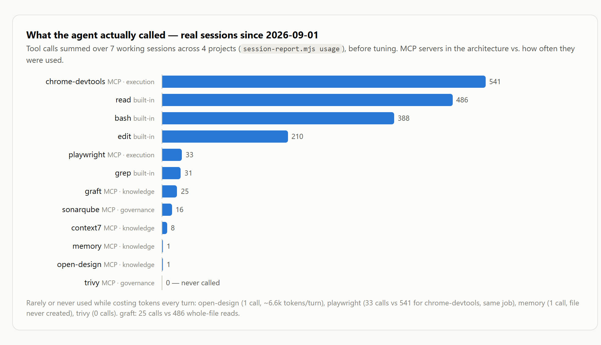
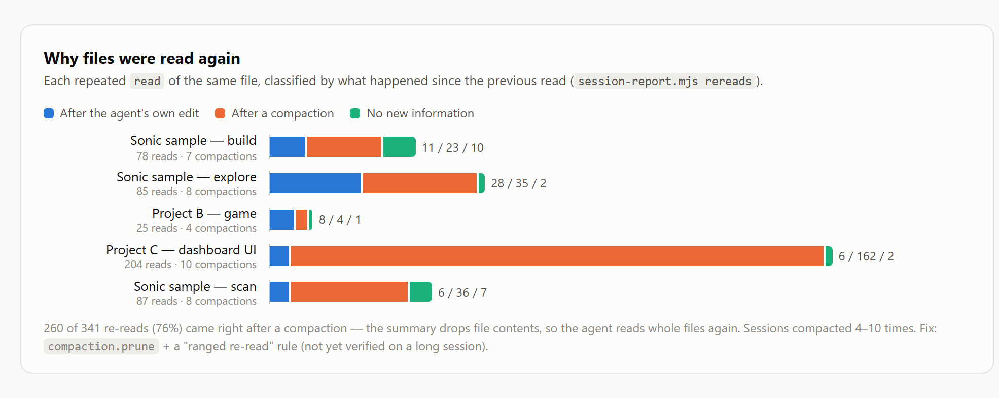
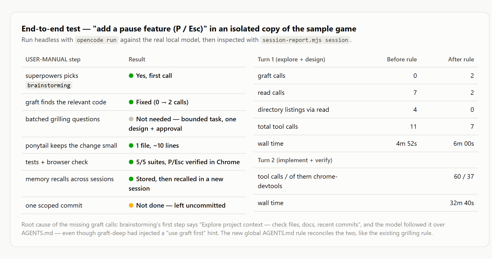

# Tuning — วัดผลจริง แล้วปรับให้ workflow ทำงานครบ

ภาพรวมที่ [[index]] · layer ตามหน้าที่ที่ [[architecture]] · workflow ที่ [[USER-MANUAL]] · ปัญหาที่เจอที่ [[gotchas]]

config ครบ ไม่ได้แปลว่า workflow ทำงานครบ — MCP ทุกตัว `connected` และ skill ทุกตัวโหลดได้ แต่ไม่ได้บอกว่า agent **ใช้** มันตามลำดับที่ [[USER-MANUAL]] กับ [[architecture]] วาดไว้จริงหรือเปล่า หน้านี้บันทึกการวัดผลจริง 4 แบบ (ทั้งหมดรันบนเครื่องตัวเอง ไม่ส่งข้อมูลออกนอกเครื่อง) ผลที่ได้ และสิ่งที่ปรับจากผลนั้น

> [!info] สรุปผล (วัดเมื่อ 2026-10-03 · OpenCode 1.18.34 · graft 0.21.1 · โมเดล self-hosted Qwen3.8 27B, context 131k)
> | สิ่งที่วัด | ก่อนปรับ | หลังปรับ |
> | --- | --- | --- |
> | prompt ต่อ turn ก่อนเริ่มทำงาน | ~43.3k tokens (131 tools) | **~32.6k tokens (84 tools), −25%** |
> | agent ใช้ graft ตอนสำรวจโค้ด (E2E turn แรก) | 0 ครั้ง, read 7 ครั้ง | **2 ครั้ง, read 2 ครั้ง** |
> | memory MCP | เรียก 1 ครั้งใน 50 session, ไฟล์ไม่เคยถูกสร้าง | **บันทึกแล้วดึงกลับได้ข้าม session** |
> | การอ่านไฟล์ซ้ำ | 76% เกิดหลัง compaction | เปิด `compaction.prune` + กฎ re-read (**ยังไม่ได้ยืนยันกับ session ยาว**) |

สคริปต์ทั้งหมดอยู่ใน [`scripts/`](../scripts/) — ใช้แค่ Node.js (≥ 22.5 สำหรับ `session-report.mjs` เพราะใช้ `node:sqlite` ที่มากับ Node) ต้นฉบับ HTML ของภาพในหน้านี้อยู่ที่ [`assets/tuning/report.html`](../assets/tuning/report.html)

---

## 1. วัดขนาด prompt ต่อ turn

ทุก turn OpenCode ส่ง system prompt, AGENTS.md ทุกไฟล์, รายชื่อ skill และ **นิยามของ tool ทุกตัวจาก MCP ที่เปิดอยู่** ไปให้โมเดลใหม่ทั้งก้อน ส่วนนี้คือ "ค่าเข้า" ที่จ่ายก่อนเริ่มทำงานจริง และกิน context 131k ของโมเดล local ไปตรงๆ

### วิธีวัด — ดัก request จริงด้วย server จำลอง

ใช้วิธีเดียวกับ [[gotchas]] ข้อ 8 (ชี้ `baseURL` ไปที่ proxy บนเครื่อง) แต่ไม่ต้องเรียกโมเดลจริงเลย — [`capture-server.mjs`](../scripts/capture-server.mjs) ทำตัวเป็น OpenAI-compatible endpoint ที่บันทึก request แล้วตอบ `ok` กลับ

```bash
# terminal 1 — เปิด server จำลอง
node scripts/capture-server.mjs ./capture

# terminal 2 — ให้ OpenCode ส่ง prompt หนึ่งครั้ง (config จริงไม่ถูกแก้ — OPENCODE_CONFIG_CONTENT ถูก merge ทับแค่ใน process นี้)
cd my-project
OPENCODE_CONFIG_CONTENT='{"provider":{"capture":{"npm":"@ai-sdk/openai-compatible","options":{"baseURL":"http://127.0.0.1:18555/v1"},"models":{"fake":{"limit":{"context":131072,"output":32768}}}}}}' \
  opencode run -m capture/fake "Reply with exactly the word: ok"

# แยกหมวด
node scripts/analyze-prompt.mjs ./capture/req-02.json
```

PowerShell ตั้ง env var แบบนี้แทน: `$env:OPENCODE_CONFIG_CONTENT='{...}'; opencode run -m capture/fake "..."`

> [!note] ไฟล์ไหนคือ prompt หลัก
> จะได้ 2 ไฟล์ — ไฟล์เล็ก (`req-01`) คือ request สร้างชื่อ session ไฟล์ใหญ่ (`req-02`) คือ prompt ที่โมเดลได้รับจริงใน turn แรก

> [!tip] ตัวเลข token แม่นแค่ไหน
> `analyze-prompt.mjs` ประมาณ token จาก จำนวนตัวอักษร ÷ 3.6 — ตรวจแล้วว่ายอดรวม "ก่อนปรับ" (~43.3k) ตรงกับ 42,920 prompt tokens ที่ provider รายงานจริงสำหรับ prompt เดียวกัน ถ้ามีตัวเลขจริงของตัวเอง ใส่ `--tokens <N>` เพื่อปรับอัตราให้ตรงเป๊ะ

### ผล



สิ่งที่เห็น:
- **MCP ฝั่งเบราว์เซอร์ 3 ตัว (open-design, chrome-devtools, playwright) กินรวม ~17.5k tokens หรือ 40%** ของ prompt ทั้งหมด ทั้งที่งานส่วนใหญ่ไม่ได้ใช้เบราว์เซอร์
- open-design คนเดียว ~6.6k tokens (tool 22 ตัว + คำสั่งของ server เอง) — แต่ถูกใช้แค่ตอนดึงงานจาก OpenDesign ([[USER-MANUAL]] ข้อ 5)
- รายชื่อ skill 25 ตัว (~3.4k), ponytail ruleset (~1.4k), superpowers bootstrap (~1k) — ทั้งหมดนี้ถูกส่ง**ทุก turn** ไม่ใช่แค่ตอนเรียก skill

---

## 2. ดูว่า agent เรียก tool อะไรจริง

OpenCode เก็บทุก tool call ของทุก session ไว้ในฐานข้อมูลของมันเอง (`~/.local/share/opencode/opencode.db`) — [`session-report.mjs`](../scripts/session-report.mjs) อ่านแบบ read-only แล้วสรุปให้

```bash
node scripts/session-report.mjs usage --since 2026-09-01
```



เทียบกับ [[architecture]] ทีละ layer:

| Layer | ที่วาดไว้ | ที่เกิดจริง |
| --- | --- | --- |
| KNOWLEDGE | graft, graft-deep, context7, memory, open-design | **graft 25 ครั้ง เทียบกับ `read` ทั้งไฟล์ 486 ครั้ง** · memory 1 ครั้ง (ไฟล์ `memory.jsonl` ไม่เคยถูกสร้างเลย) · open-design 1 ครั้ง |
| REASONING | brainstorming, grilling, writing-plans | ✅ brainstorming และ writing-plans ถูกใช้สม่ำเสมอ · grilling ถูกเรียกเป็น skill แยกแค่ 2 ครั้ง — ตามกฎใน AGENTS.md มันควรทำงานเป็นรูปแบบคำถามข้างใน brainstorming ซึ่งไม่ถูกนับเป็น skill call (ยังไม่ได้ตรวจว่ารูปแบบนั้นถูกใช้ทุกครั้งหรือไม่) |
| EXECUTION | ponytail, playwright, chrome-devtools | ✅ chrome-devtools 541 ครั้ง · **playwright 33 ครั้ง** — ทำงานซ้อนกับ chrome-devtools |
| GOVERNANCE | verification, sonarqube, trivy | sonarqube ใช้ใน 1–6 session · **trivy 0 ครั้ง** |

---

## 3. ทำไมอ่านไฟล์เดิมซ้ำ

ตัวเลข `read` ที่สูงไม่ได้แปลว่า "ไม่ใช้ graft" เสมอไป — OpenCode บังคับให้ `read` ไฟล์ก่อน `edit` อยู่แล้ว เลยแยกดูการอ่าน**ซ้ำ**ไฟล์เดิม ว่าแต่ละครั้งเกิดหลังเหตุการณ์อะไร

```bash
node scripts/session-report.mjs rereads --since 2026-09-01
```



**260 จาก 341 ครั้ง (76%) เกิดทันทีหลัง compaction** — session ทั่วไป compact 4–10 ครั้ง ทุกครั้งที่ OpenCode สรุป context เนื้อหาไฟล์ที่เคยอ่านไว้จะหายไป agent เลยอ่านทั้งไฟล์ใหม่ (session หนึ่งอ่านซ้ำหลัง compaction 162 ครั้ง ผลอ่านซ้ำทั้ง session รวม ~221k tokens) ต้นเหตุจึงอยู่ที่ **compaction บ่อยเกินไป** ไม่ใช่ graft

---

## 4. ทดสอบครบวงจร (E2E) ในสำเนาของโปรเจกต์

ขอ feature จริงแบบเดียวกับตัวอย่างใน [[USER-MANUAL]] ข้อ 3 แล้วดูว่า agent เดินตาม 9 ขั้นหรือไม่ — **ทำในสำเนาเสมอ** อย่าทดสอบในโปรเจกต์จริง

```bash
git clone ~/code/my-project ~/tmp/my-project-e2e
cp ~/code/my-project/AGENTS.md ~/code/my-project/opencode.json ~/tmp/my-project-e2e/   # ไฟล์ที่ยังไม่ได้ commit ต้อง copy เอง
cd ~/tmp/my-project-e2e && graft build

opencode run --title e2e-pause "please add a pause feature to the game: pressing P (or Esc) pauses and resumes gameplay"
node /path/to/scripts/session-report.mjs session e2e-pause   # ดูผล turn แรก

# ตอบคำถาม/อนุมัติใน session เดิม
opencode run -s <session-id> "go ahead"
```

> [!note] `opencode run` ไม่มี tool `question`
> ในโหมด headless OpenCode ไม่ส่ง tool `question` ให้โมเดล (ดูได้จาก request ที่ดักไว้ในข้อ 1) brainstorming จึงถามเป็นข้อความธรรมดาแล้วจบ turn — ตอบต่อด้วย `opencode run -s <id>` ได้โดยไม่ค้าง session id ดูได้จาก `opencode session list`



ผลที่ได้:
- ✅ `brainstorming` ถูกเรียกเป็นอย่างแรกเสมอ และงานเล็กได้ดีไซน์ที่แคบ (1 ไฟล์ ~10 บรรทัด) — ponytail ทำงาน
- ✅ รันเทสต์ครบ และตรวจปุ่ม P/Esc ใน Chrome จริงผ่าน chrome-devtools
- ❌→✅ **graft ไม่ถูกเรียกเลย** — ทั้งที่ graft-deep inject คำแนะนำ "use graft first" ไว้แล้ว ต้นเหตุคือขั้นแรกของ `brainstorming` เขียนว่า *"Explore project context — check files, docs, recent commits"* โมเดลทำตามคำสั่งของ skill (รัน `git log`, `read` โฟลเดอร์ทีละอัน) ทับคำสั่งใน AGENTS.md — ปัญหาแบบเดียวกับที่ต้องเขียนกฎประสานงานให้ grilling ใน [[plugins]] แก้ด้วยกฎใหม่ใน global AGENTS.md (ข้อ 5) แล้วรันคำขอเดิมซ้ำ: graft 0 → 2 ครั้ง, `read` 7 → 2 ครั้ง (เหลือแค่ไฟล์ที่จะแก้)
- ⚠️ **ไม่ commit** ตอนจบ (ขั้นที่ 9) — ยังไม่ได้ใส่กฎบังคับ เพราะจะทำให้ agent commit เองในทุกโปรเจกต์
- ⚠️ **การตรวจในเบราว์เซอร์ช้า** — turn ที่ลงมือทำใช้ 32 นาที เรียก chrome-devtools 37 จาก 60 ครั้ง (ส่วนใหญ่เป็น `evaluate_script`) ทุก step ส่ง prompt ที่โตขึ้นเรื่อยๆ (สูงสุด ~81k tokens) ให้โมเดล local ประมวลผลใหม่

> [!tip] ได้ bug จริงเป็นของแถม
> ระหว่างทดสอบ agent พบว่าเมนูของเกมตัวอย่างพังตั้งแต่เปิด (scene ยังเรียกชื่อ API เก่าหลัง refactor) — การทดสอบครบวงจรเป็นระยะช่วยจับปัญหาที่เทสต์ของตัวโค้ดไม่ครอบคลุมได้ด้วย

---

## 5. สิ่งที่ปรับ (config ที่ใช้จริงหลังทดสอบ)

### 5.1 ปิด MCP ที่ใช้น้อยเป็นค่าเริ่มต้น แล้วเปิดเฉพาะโปรเจกต์ที่ต้องใช้

ใน `~/.config/opencode/opencode.jsonc`:

```jsonc
"open-design": {
  "type": "local",
  "command": ["od", "mcp"],
  "timeout": 30000,
  "enabled": false        // ~6.6k tokens/turn, ใช้แค่ตอนดึงงานจาก OpenDesign
},
"playwright": {
  "type": "local",
  "command": ["npx", "-y", "@playwright/mcp@latest"],
  "timeout": 30000,
  "enabled": false        // ซ้อนกับ chrome-devtools; e2e suite ยังรัน `npx playwright test` ผ่าน bash ได้
}
```

เปิดเฉพาะโปรเจกต์ใน `<project>/opencode.json` (merge กับ global — ใส่แค่ field ที่เปลี่ยน):

```jsonc
{ "mcp": { "open-design": { "enabled": true } } }
```

### 5.2 เปิด `compaction.prune`

```jsonc
"compaction": { "auto": true, "prune": true }
```

`prune` (ค่าเริ่มต้นปิด) ทำงานตอนจบแต่ละคำสั่ง: ลบผลลัพธ์ของ tool ที่เก่ากว่า 2 turn ล่าสุด โดยเว้นผลล่าสุด ~40k tokens ไว้เสมอ และจะลบก็ต่อเมื่อมีให้ลบเกิน ~20k tokens (ตรวจจาก source ของ OpenCode 1.18.34) — ลบเป็นก้อนใหญ่นานๆ ครั้ง prompt cache ของ llama.cpp จึงไม่เสียทุก turn แต่ช่วยให้ compaction เต็มรูปแบบเกิดน้อยลง

### 5.3 กฎใหม่ 3 ข้อใน global AGENTS.md

ต่อท้ายกฎ grill-me เดิม ([[plugins]]) ใน `~/.config/opencode/AGENTS.md` — เขียนเป็นภาษาอังกฤษเพราะเป็นคำสั่งให้โมเดล (~480 tokens รวมกัน):

```markdown
## Exploring a codebase — graft first, even inside a skill

Skills such as `brainstorming` ("Explore project context — check files,
docs, recent commits") tell you to look around the project. When the
project has a `graft/` index, do that step through graft instead of
listing directories and reading files one by one:
`graft_graft_repo_map` for orientation, `graft_graft_find_code` for "where
is X / how does Y work", `graft_graft_file_api` to skim a file, and
`graft_graft_trace_calls` for callers. Then `read` only the files you are
about to edit. Directory listings and whole-file reads are the fallback
when there is no `graft/` index.

## Re-reading files after compaction or pruning

When you need a file you already read earlier in this session (its content
was compacted or pruned away), do not re-read the whole file. If the
project has a `graft/` index, run `graft skeleton <file>` or `graft ask
"<symbol>" --source` first; then `read` only the lines you need with
`offset`/`limit`. A full read is fine right before editing a file you
have not read since the last compaction.

## Memory — facts that must outlive this session (memory MCP)

- Before asking the user about a preference or a past decision, call
  `memory_search_nodes` with the project's folder name (and "user") — the
  answer may already be stored.
- When the user states a durable preference, or brainstorming/grilling
  settles a decision that later sessions will need, save it:
  `memory_create_entities` for a new project/user entity, otherwise
  `memory_add_observations` — one short sentence per fact, prefixed with
  today's date (YYYY-MM-DD).
- Never store secrets, code, or anything the repo already records
  (graft, git history, specs under `docs/`).
```

> [!important] ชื่อ tool ต้องตรงกับที่โมเดลเห็นจริง
> OpenCode ตั้งชื่อ tool ของ MCP เป็น `<server>_<tool>` — graft จึงกลายเป็น `graft_graft_find_code` ฯลฯ ดูชื่อจริงได้จาก request ที่ดักไว้ในข้อ 1 ก่อนเขียนกฎที่อ้างชื่อ tool

ผลทดสอบกฎ memory ด้วยโมเดลจริง: session แรกสั่ง "remember …" → agent เรียก `memory_search_nodes` แล้ว `memory_create_entities` พร้อมวันที่ · session ใหม่ถามกลับ → agent เรียก `memory_search_nodes` จนเจอแล้วตอบถูก

### 5.4 ตัด skill ของเครื่องมืออื่นออก — `OPENCODE_DISABLE_EXTERNAL_SKILLS=1`

OpenCode โหลด skill จาก `~/.claude/skills` (Claude Code) และ `~/.agents/skills` มาด้วยโดยอัตโนมัติ — บนเครื่องที่ติดตั้งเครื่องมือ AI หลายตัว รายชื่อ skill พองจาก 25 เป็น 86 ตัว (ทุกตัวถูกส่งในทุก turn และโมเดลเล็กเลือกผิดง่าย) ตั้ง env var ระดับ user:

```powershell
[Environment]::SetEnvironmentVariable('OPENCODE_DISABLE_EXTERNAL_SKILLS','1','User')   # Windows
```

```bash
export OPENCODE_DISABLE_EXTERNAL_SKILLS=1   # macOS/Linux — ใส่ใน shell profile
```

ตรวจด้วย `opencode debug skill` — ควรเหลือเฉพาะ skill จาก superpowers, ponytail, i-have-adhd, grill-me/grilling และ `customize-opencode` ที่มากับ OpenCode — รายละเอียดว่าทำไมไม่ใช้ `OPENCODE_DISABLE_CLAUDE_CODE_SKILLS` อยู่ใน [[gotchas]] ข้อ 15

### 5.5 context7 — ส่ง API key ผ่าน header จาก env var

ถ้ามี key ของ context7 (ไม่บังคับ — ไม่มีก็ใช้ได้แต่ติด rate limit) อย่าเขียน key ลง config ตรงๆ:

```jsonc
"context7": {
  "type": "remote",
  "url": "https://mcp.context7.com/mcp",
  "headers": { "CONTEXT7_API_KEY": "{env:CONTEXT7_API_KEY}" },
  "enabled": true
}
```

---

## 6. ยังไม่ได้แก้ / ต้องติดตามต่อ

- **ผลของ `prune` + กฎ re-read** — session ทดสอบสั้นจนไม่เกิด compaction เลย ให้รัน `session-report.mjs rereads` อีกครั้งหลังใช้งานจริงไปสักพัก แล้วเทียบสัดส่วน "after a compaction" กับ 76% เดิม
- **ขั้น commit** — ถ้าต้องการให้ตรง [[USER-MANUAL]] ขั้นที่ 9 เพิ่มกฎใน AGENTS.md ให้ commit เป็นก้อนเดียวหลังตรวจผ่าน (ไม่ push) — ตัดสินใจเองว่าอยากให้ agent commit เองหรือเปล่า
- **การตรวจในเบราว์เซอร์** — 37 calls / 32 นาทีสำหรับ feature เล็กๆ ยังไม่มีวิธีแก้ที่ทดสอบแล้ว
- **trivy ไม่เคยถูกเรียก** — ยังเปิดไว้ตาม [[architecture]] (~1.7k tokens/turn) ถ้าวัดซ้ำแล้วยังเป็น 0 พิจารณาปิด แล้วให้ agent รัน `trivy fs .` ผ่าน bash หรือใส่ใน CI ตาม [[sdlc]]

---

## 7. เครื่องมือที่ลองแล้วไม่ได้ใช้ต่อ (และเหตุผล)

| เครื่องมือ | ทำอะไร | ผลที่ได้ | เหตุผลที่ไม่ใช้ต่อ |
| --- | --- | --- | --- |
| [Langfuse](https://github.com/langfuse/langfuse) self-host + [opencode-observability-plugin](https://github.com/langfuse/opencode-observability-plugin) | trace เต็มทุก turn: prompt, generation, tool call, reasoning, token | ✅ ใช้ได้ — trace เข้า Langfuse บนเครื่อง | เก็บเนื้อหาเต็มรวมผลของ tool (ไฟล์ที่ agent อ่าน); Docker 6 containers ใช้ RAM ~2.6 GB — ถอดออกตามความชอบ |
| [opencode-observability](https://github.com/abekdwight/opencode-observability) | dashboard/monitor บน `127.0.0.1` อ่าน `opencode.db` | ✅ ใช้ได้ | UI บางส่วนเป็นภาษาญี่ปุ่น |
| [token-optimizer](https://github.com/alexgreensh/token-optimizer) | quality score, compaction guidance, session continuity | ประเมินจากโค้ด ไม่ได้ติดตั้ง | plugin ฝั่ง OpenCode **ไม่มี**การบีบอัด output ของ tool (ตัวเลขประหยัดใน README มาจาก Claude Code); มี nudge อัตโนมัติเมื่อ context ≥ 25% ซึ่ง setup นี้เกินตั้งแต่ turn แรก; license PolyForm Noncommercial |

> [!warning] ข้อควรรู้ถ้าจะ self-host Langfuse เอง
> - compose ทางการ map ClickHouse ไว้ที่ host port `9000` — ชนกับ SonarQube ถ้ารันที่ `9000` ใช้ไฟล์ `docker-compose.override.yml` เอา port ที่ไม่จำเป็นออก (`ports: !reset []`) แทนการแก้ไฟล์ทางการ
> - `TELEMETRY_ENABLED` ค่าเริ่มต้นเป็น `true` — ปิดเองถ้าต้องการ self-host จริง
> - Langfuse v4 ไม่มี `/api/public/traces` แล้ว (events-only) — ใช้ `/api/public/v2/observations`
> - plugin ใช้ env var `LANGFUSE_*` แทน cloud ก็ต่อเมื่อตั้งทั้ง public **และ** secret key

> [!tip] เกณฑ์เลือกเครื่องมือเพิ่ม
> ก่อนติดตั้งอะไรใหม่ ถาม 2 ข้อ: (1) อยู่ layer ไหนใน [[architecture]] และซ้ำกับของที่มีหรือเปล่า (2) ใส่อะไรเข้า prompt ทุก turn บ้าง — วัดด้วยข้อ 1 ก่อนและหลังติดตั้งได้เลย
